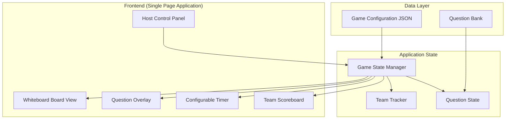
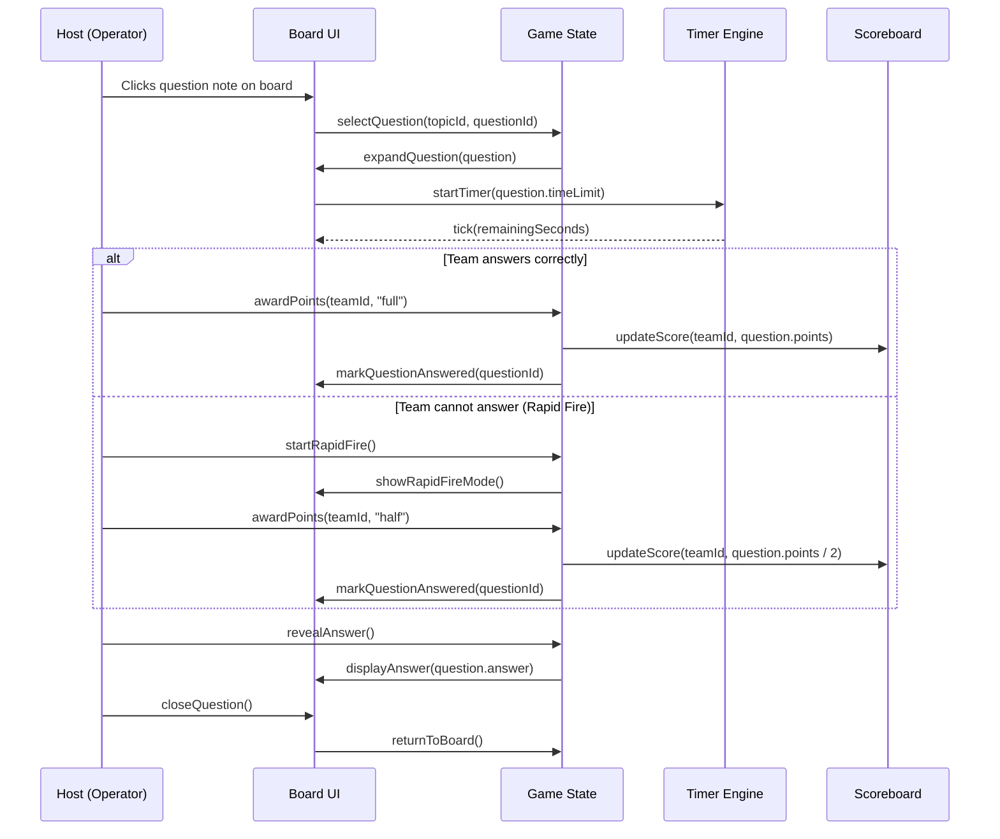
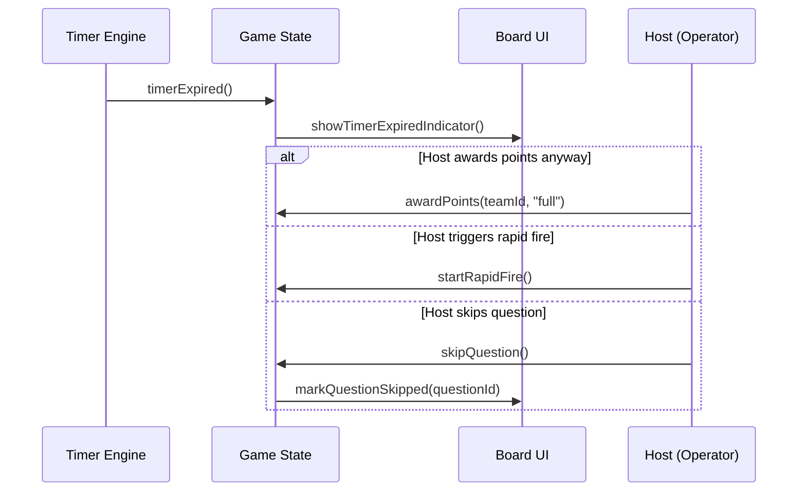

# Design Document: Trivia Game Website

## Overview

The Trivia Game Website is a host-controlled, whiteboard-style trivia board displayed as a web application. It features swimlanes organized by topic, where each topic contains 5-6 questions represented as color-coded sticky notes of increasing difficulty. A single host operator controls the entire flow — selecting questions, revealing them, managing timers, and assigning points to teams.

The system operates without user accounts. Teams are tracked by name, and all interactions flow through the host's browser. The board acts as a visual billboard: questions expand into full-screen overlays with configurable timers, and answers are revealed only on host command. Scoring supports full points for direct answers and half points for rapid-fire rounds when the original team cannot answer.

## Architecture



## Sequence Diagrams

### Main Flow: Selecting and Answering a Question



### Timer Expiry Flow



## Components and Interfaces

### Component 1: GameBoard

**Purpose**: Renders the whiteboard with swimlane topics and question notes

**Interface**:
```pascal
INTERFACE GameBoard
  renderBoard(config: GameConfig): BoardView
  getQuestionNote(topicId: String, questionId: String): NoteElement
  markAsAnswered(questionId: String): void
  markAsSkipped(questionId: String): void
  getDifficultyColor(difficulty: Integer): Color
END INTERFACE
```

**Responsibilities**:
- Display topics as vertical swimlanes
- Render questions as sticky-note cards with difficulty color coding
- Show visual state for answered/unanswered/skipped questions
- Handle click events from host for question selection

### Component 2: QuestionOverlay

**Purpose**: Expands a selected question to full screen with timer and controls

**Interface**:
```pascal
INTERFACE QuestionOverlay
  open(question: Question): void
  close(): void
  showAnswer(answer: String): void
  showRapidFireMode(): void
  getTimerDisplay(): TimerComponent
END INTERFACE
```

**Responsibilities**:
- Animate question note expansion to overlay
- Display question text prominently
- Show countdown timer
- Provide host controls: Reveal Answer, Award Points, Rapid Fire, Close
- Keep whiteboard visible in background (dimmed)

### Component 3: TimerEngine

**Purpose**: Manages configurable countdown timers per question

**Interface**:
```pascal
INTERFACE TimerEngine
  start(durationSeconds: Integer): void
  pause(): void
  resume(): void
  reset(durationSeconds: Integer): void
  getRemainingTime(): Integer
  isExpired(): Boolean
  onTick(callback: Function): void
  onExpire(callback: Function): void
END INTERFACE
```

**Responsibilities**:
- Countdown from configurable duration
- Emit tick events each second for UI updates
- Emit expiry event when timer reaches zero
- Support pause/resume for host flexibility

### Component 4: TeamScoreboard

**Purpose**: Tracks teams, scores, and current turn assignment

**Interface**:
```pascal
INTERFACE TeamScoreboard
  addTeam(name: String): TeamId
  removeTeam(teamId: TeamId): void
  getTeams(): List<Team>
  getCurrentTeam(): Team
  setCurrentTeam(teamId: TeamId): void
  addScore(teamId: TeamId, points: Integer): void
  getScores(): List<TeamScore>
  resetScores(): void
END INTERFACE
```

**Responsibilities**:
- Maintain list of participating teams
- Track which team is currently answering
- Accumulate and display scores
- Support rapid-fire team selection for half-point awards

### Component 5: HostControlPanel

**Purpose**: Provides the host with all game management controls

**Interface**:
```pascal
INTERFACE HostControlPanel
  selectQuestion(topicId: String, questionId: String): void
  revealAnswer(): void
  awardFullPoints(teamId: TeamId): void
  startRapidFire(): void
  awardHalfPoints(teamId: TeamId): void
  skipQuestion(): void
  closeQuestion(): void
  setCurrentTeam(teamId: TeamId): void
  configureTimer(questionId: String, seconds: Integer): void
END INTERFACE
```

**Responsibilities**:
- Mediate all host actions to the game state
- Ensure answer reveal is manual only
- Manage team turn order
- Control rapid-fire flow

## Data Models

### GameConfig

```pascal
STRUCTURE GameConfig
  title: String
  topics: List<Topic>
  teams: List<TeamConfig>
  defaultTimerSeconds: Integer
END STRUCTURE

STRUCTURE Topic
  id: String
  name: String
  questions: List<Question>
END STRUCTURE

STRUCTURE Question
  id: String
  text: String
  answer: String
  difficulty: Integer          -- 1 to 5
  points: Integer              -- based on difficulty
  timerSeconds: Integer        -- override per question, nullable
  status: QuestionStatus       -- AVAILABLE, ANSWERED, SKIPPED
END STRUCTURE

ENUMERATION QuestionStatus
  AVAILABLE
  ANSWERED
  SKIPPED
END ENUMERATION
```

**Validation Rules**:
- Each topic must have between 1 and 6 questions
- Difficulty must be between 1 and 5 (inclusive)
- Points must be a positive integer
- timerSeconds, if provided, must be a positive integer
- Question IDs must be unique across all topics

### Team

```pascal
STRUCTURE Team
  id: TeamId
  name: String
  score: Integer
  questionsAnswered: Integer
END STRUCTURE

STRUCTURE TeamConfig
  name: String
END STRUCTURE
```

**Validation Rules**:
- Team name must be non-empty and unique
- Score is always non-negative
- questionsAnswered is always non-negative

### GameState

```pascal
STRUCTURE GameState
  config: GameConfig
  teams: List<Team>
  currentTeamId: TeamId
  activeQuestion: Question OR NULL
  isRapidFire: Boolean
  isAnswerRevealed: Boolean
  answeredQuestions: Set<String>
  phase: GamePhase
END STRUCTURE

ENUMERATION GamePhase
  BOARD_VIEW
  QUESTION_OPEN
  RAPID_FIRE
  ANSWER_REVEALED
END ENUMERATION
```

## Algorithmic Pseudocode

### Main Game Loop: Select and Score a Question

```pascal
ALGORITHM selectAndScoreQuestion(topicId, questionId)
INPUT: topicId (String), questionId (String)
OUTPUT: Updated game state with question resolved

BEGIN
  question ← findQuestion(topicId, questionId)
  
  ASSERT question.status = AVAILABLE
  ASSERT gameState.phase = BOARD_VIEW
  
  -- Transition to question open phase
  gameState.activeQuestion ← question
  gameState.phase ← QUESTION_OPEN
  gameState.isRapidFire ← FALSE
  gameState.isAnswerRevealed ← FALSE
  
  -- Determine timer duration
  timerDuration ← question.timerSeconds
  IF timerDuration IS NULL THEN
    timerDuration ← gameState.config.defaultTimerSeconds
  END IF
  
  -- Start timer
  timer.start(timerDuration)
  
  -- Expand question overlay with animation
  overlay.open(question)
  
  -- Wait for host action (event-driven, not blocking)
  RETURN gameState
END
```

**Preconditions:**
- `topicId` corresponds to a valid topic in the config
- `questionId` corresponds to a valid, available question
- Game is currently in BOARD_VIEW phase (no other question is open)

**Postconditions:**
- `gameState.phase` is QUESTION_OPEN
- `gameState.activeQuestion` is the selected question
- Timer has started counting down
- Question overlay is displayed

**Loop Invariants:** N/A (event-driven, no loops)

### Award Points Algorithm

```pascal
ALGORITHM awardPoints(teamId, mode)
INPUT: teamId (TeamId), mode ("full" OR "half")
OUTPUT: Updated team score

BEGIN
  ASSERT gameState.activeQuestion IS NOT NULL
  ASSERT gameState.phase = QUESTION_OPEN OR gameState.phase = RAPID_FIRE
  
  question ← gameState.activeQuestion
  team ← findTeam(teamId)
  
  ASSERT team IS NOT NULL
  
  IF mode = "full" THEN
    pointsToAward ← question.points
  ELSE IF mode = "half" THEN
    pointsToAward ← FLOOR(question.points / 2)
  END IF
  
  -- Update team score
  team.score ← team.score + pointsToAward
  team.questionsAnswered ← team.questionsAnswered + 1
  
  -- Mark question as answered
  question.status ← ANSWERED
  gameState.answeredQuestions.add(question.id)
  
  RETURN team.score
END
```

**Preconditions:**
- A question is currently active (open on screen)
- `teamId` refers to a valid, existing team
- `mode` is either "full" or "half"
- Game phase is QUESTION_OPEN or RAPID_FIRE

**Postconditions:**
- Team's score is increased by the correct amount
- Question is marked as ANSWERED
- Team's questionsAnswered count is incremented by 1

**Loop Invariants:** N/A

### Rapid Fire Transition

```pascal
ALGORITHM startRapidFire()
INPUT: none (operates on current game state)
OUTPUT: Game state transitioned to rapid fire mode

BEGIN
  ASSERT gameState.phase = QUESTION_OPEN
  ASSERT gameState.activeQuestion IS NOT NULL
  
  -- Pause timer if still running
  IF NOT timer.isExpired() THEN
    timer.pause()
  END IF
  
  -- Transition to rapid fire phase
  gameState.phase ← RAPID_FIRE
  gameState.isRapidFire ← TRUE
  
  -- Update UI to show rapid fire indicator
  overlay.showRapidFireMode()
  
  -- Host will now select which team answered
  -- and call awardPoints(teamId, "half")
  
  RETURN gameState
END
```

**Preconditions:**
- A question is currently open (QUESTION_OPEN phase)
- The current team has failed to answer (host decision)

**Postconditions:**
- Game phase is RAPID_FIRE
- Timer is paused
- UI shows rapid fire mode indicator
- Host can now select any team for half-point award

**Loop Invariants:** N/A

### Reveal Answer Algorithm

```pascal
ALGORITHM revealAnswer()
INPUT: none (operates on current game state)
OUTPUT: Answer displayed on overlay

BEGIN
  ASSERT gameState.activeQuestion IS NOT NULL
  ASSERT gameState.isAnswerRevealed = FALSE
  ASSERT gameState.phase = QUESTION_OPEN OR gameState.phase = RAPID_FIRE
  
  -- Reveal the answer
  gameState.isAnswerRevealed ← TRUE
  gameState.phase ← ANSWER_REVEALED
  
  -- Display answer on overlay
  overlay.showAnswer(gameState.activeQuestion.answer)
  
  RETURN gameState
END
```

**Preconditions:**
- A question is currently active
- Answer has not already been revealed
- Host explicitly triggers this action

**Postconditions:**
- `gameState.isAnswerRevealed` is TRUE
- Game phase is ANSWER_REVEALED
- Answer is visible in the overlay UI

**Loop Invariants:** N/A

### Close Question and Return to Board

```pascal
ALGORITHM closeQuestion()
INPUT: none (operates on current game state)
OUTPUT: Game returned to board view

BEGIN
  ASSERT gameState.activeQuestion IS NOT NULL
  
  -- Stop timer if running
  IF NOT timer.isExpired() THEN
    timer.pause()
  END IF
  timer.reset(0)
  
  -- If question was never scored, mark as skipped
  IF gameState.activeQuestion.status = AVAILABLE THEN
    gameState.activeQuestion.status ← SKIPPED
  END IF
  
  -- Reset active question state
  gameState.activeQuestion ← NULL
  gameState.isRapidFire ← FALSE
  gameState.isAnswerRevealed ← FALSE
  gameState.phase ← BOARD_VIEW
  
  -- Close overlay with animation
  overlay.close()
  
  RETURN gameState
END
```

**Preconditions:**
- A question overlay is currently open

**Postconditions:**
- `gameState.phase` is BOARD_VIEW
- `gameState.activeQuestion` is NULL
- Timer is stopped and reset
- Overlay is closed, board is fully visible
- Unanswered question is marked SKIPPED

**Loop Invariants:** N/A

## Key Functions with Formal Specifications

### Function: findQuestion()

```pascal
PROCEDURE findQuestion(topicId, questionId)
  INPUT: topicId (String), questionId (String)
  OUTPUT: Question OR error
  
  SEQUENCE
    topic ← NULL
    FOR each t IN gameState.config.topics DO
      IF t.id = topicId THEN
        topic ← t
        EXIT FOR
      END IF
    END FOR
    
    IF topic IS NULL THEN
      RAISE Error("Topic not found: " + topicId)
    END IF
    
    question ← NULL
    FOR each q IN topic.questions DO
      IF q.id = questionId THEN
        question ← q
        EXIT FOR
      END IF
    END FOR
    
    IF question IS NULL THEN
      RAISE Error("Question not found: " + questionId)
    END IF
    
    RETURN question
  END SEQUENCE
END PROCEDURE
```

**Preconditions:**
- `topicId` is a non-empty string
- `questionId` is a non-empty string

**Postconditions:**
- Returns the matching Question object
- Raises error if topic or question not found

### Function: getDifficultyColor()

```pascal
PROCEDURE getDifficultyColor(difficulty)
  INPUT: difficulty (Integer, 1-5)
  OUTPUT: Color (String, hex code)
  
  SEQUENCE
    ASSERT difficulty >= 1 AND difficulty <= 5
    
    colorMap ← {
      1: "#4CAF50",   -- Green (easy)
      2: "#8BC34A",   -- Light green
      3: "#FFC107",   -- Amber (medium)
      4: "#FF9800",   -- Orange
      5: "#F44336"    -- Red (hard)
    }
    
    RETURN colorMap[difficulty]
  END SEQUENCE
END PROCEDURE
```

**Preconditions:**
- `difficulty` is an integer between 1 and 5

**Postconditions:**
- Returns a valid hex color string
- Color corresponds to difficulty (green=easy, red=hard)

### Function: calculateHalfPoints()

```pascal
PROCEDURE calculateHalfPoints(fullPoints)
  INPUT: fullPoints (Integer, positive)
  OUTPUT: Integer (half points, floored)
  
  SEQUENCE
    ASSERT fullPoints > 0
    
    halfPoints ← FLOOR(fullPoints / 2)
    
    -- Ensure at least 1 point for rapid fire
    IF halfPoints = 0 THEN
      halfPoints ← 1
    END IF
    
    RETURN halfPoints
  END SEQUENCE
END PROCEDURE
```

**Preconditions:**
- `fullPoints` is a positive integer

**Postconditions:**
- Returns floor(fullPoints / 2), minimum 1
- Result is always a positive integer

## Example Usage

```pascal
-- Example: Setting up a trivia game
SEQUENCE
  -- Define game configuration
  config ← GameConfig {
    title: "Friday Trivia Night",
    defaultTimerSeconds: 30,
    topics: [
      Topic {
        id: "science",
        name: "Science",
        questions: [
          Question { id: "sci-1", text: "What planet is closest to the sun?",
                     answer: "Mercury", difficulty: 1, points: 100, timerSeconds: NULL },
          Question { id: "sci-2", text: "What is the chemical symbol for gold?",
                     answer: "Au", difficulty: 2, points: 200, timerSeconds: NULL },
          Question { id: "sci-3", text: "What is the speed of light in m/s?",
                     answer: "299,792,458 m/s", difficulty: 4, points: 400, timerSeconds: 45 }
        ]
      },
      Topic {
        id: "history",
        name: "History",
        questions: [
          Question { id: "his-1", text: "In what year did WW2 end?",
                     answer: "1945", difficulty: 1, points: 100, timerSeconds: NULL },
          Question { id: "his-2", text: "Who was the first Roman Emperor?",
                     answer: "Augustus", difficulty: 3, points: 300, timerSeconds: NULL }
        ]
      }
    ],
    teams: [
      TeamConfig { name: "Team Alpha" },
      TeamConfig { name: "Team Beta" },
      TeamConfig { name: "Team Gamma" }
    ]
  }
  
  -- Initialize game
  gameState ← initializeGame(config)
  
  -- Host selects a question
  selectAndScoreQuestion("science", "sci-2")
  -- Timer starts at 30 seconds (default)
  -- Question overlay expands
  
  -- Team Alpha answers correctly
  awardPoints("team-alpha", "full")
  -- Team Alpha score: 0 + 200 = 200
  
  -- Host reveals answer
  revealAnswer()
  -- "Au" is displayed
  
  -- Host closes question
  closeQuestion()
  -- Board view returns, sci-2 marked as answered
  
  -- Later: Host selects a harder question
  selectAndScoreQuestion("science", "sci-3")
  -- Timer starts at 45 seconds (question override)
  
  -- Team Beta cannot answer → Rapid Fire
  startRapidFire()
  -- Timer pauses, rapid fire mode shown
  
  -- Team Gamma answers in rapid fire
  awardPoints("team-gamma", "half")
  -- Team Gamma score: 0 + 200 (half of 400) = 200
  
  -- Host reveals and closes
  revealAnswer()
  closeQuestion()
END SEQUENCE
```

## Correctness Properties

*A property is a characteristic or behavior that should hold true across all valid executions of a system — essentially, a formal statement about what the system should do. Properties serve as the bridge between human-readable specifications and machine-verifiable correctness guarantees.*

### Property 1: Questions display in difficulty order

*For any* topic swimlane containing multiple questions, the Sticky_Notes SHALL be arranged in non-decreasing order of difficulty value from top to bottom.

**Validates: Requirements 1.3**

### Property 2: Difficulty color mapping is deterministic

*For any* question with a valid difficulty value (1-5), the getDifficultyColor function SHALL return the same specific hex color for that difficulty level, matching the defined color scale.

**Validates: Requirements 1.4**

### Property 3: Selecting an available question transitions to QUESTION_OPEN

*For any* game state in BOARD_VIEW phase and any question with status AVAILABLE, selecting that question SHALL result in Game_Phase becoming QUESTION_OPEN with that question as the active question.

**Validates: Requirements 2.1, 11.2**

### Property 4: Non-available questions cannot be selected

*For any* question with status ANSWERED or SKIPPED, clicking that question SHALL not change the game state.

**Validates: Requirements 2.2**

### Property 5: At most one question is active at any time

*For any* sequence of valid host actions, there SHALL be at most one question in an active state (Game_Phase of QUESTION_OPEN, RAPID_FIRE, or ANSWER_REVEALED) at any time.

**Validates: Requirements 2.5, 11.5**

### Property 6: Timer duration selection

*For any* selected question, the Timer_Engine SHALL start with the question's timerSeconds value if present, otherwise with the game configuration's defaultTimerSeconds value.

**Validates: Requirements 3.1, 3.2**

### Property 7: Timer pause-resume round trip

*For any* running timer with remaining time T, pausing and then immediately resuming the timer SHALL result in the timer continuing from time T.

**Validates: Requirements 3.6, 3.7**

### Property 8: Timer expiry does not auto-transition game phase

*For any* game state where the timer expires, the Game_Phase SHALL remain unchanged until an explicit host action occurs.

**Validates: Requirements 3.5**

### Property 9: Full point award correctness

*For any* active question with point value P and any valid team, awarding full points SHALL increase that team's score by exactly P.

**Validates: Requirements 4.1**

### Property 10: Half point calculation

*For any* positive integer point value P, calculateHalfPoints(P) SHALL return max(1, floor(P / 2)).

**Validates: Requirements 4.2, 4.3**

### Property 11: Point award side effects

*For any* point award (full or half) to a team for an active question, the team's questions-answered count SHALL increment by 1 and the question status SHALL become ANSWERED.

**Validates: Requirements 4.4, 4.5**

### Property 12: Scores are non-negative

*For any* sequence of valid game actions, every team's score SHALL remain greater than or equal to zero at all times.

**Validates: Requirements 4.6**

### Property 13: Rapid fire transition from QUESTION_OPEN

*For any* game state in QUESTION_OPEN phase, triggering rapid fire SHALL transition the Game_Phase to RAPID_FIRE and pause the timer if it is still running.

**Validates: Requirements 5.1, 5.3**

### Property 14: Half points only in RAPID_FIRE

*For any* game state where the Game_Phase is not RAPID_FIRE, attempting to award half points SHALL be rejected and the state SHALL remain unchanged.

**Validates: Requirements 5.4, 5.5, 11.3**

### Property 15: Answer cannot be revealed twice

*For any* game state where isAnswerRevealed is TRUE, triggering answer reveal SHALL be rejected and the state SHALL remain unchanged.

**Validates: Requirements 6.2**

### Property 16: Close question cleanup

*For any* game state with an active question, closing the question SHALL result in Game_Phase becoming BOARD_VIEW, activeQuestion becoming null, isRapidFire becoming false, and isAnswerRevealed becoming false.

**Validates: Requirements 7.1, 7.4, 11.1**

### Property 17: Unanswered question becomes SKIPPED on close

*For any* active question with status AVAILABLE (never scored), closing the question SHALL mark its status as SKIPPED.

**Validates: Requirements 7.2**

### Property 18: Team initialization from config

*For any* valid game configuration with N unique non-empty team names, initializing the game SHALL create exactly N teams each with score 0 and questionsAnswered 0.

**Validates: Requirements 8.1, 8.2**

### Property 19: Configuration validation rejects invalid data

*For any* game configuration that violates constraints (topic with 0 or >6 questions, difficulty outside 1-5, non-positive points, duplicate question IDs, non-positive default timer), validation SHALL reject the configuration.

**Validates: Requirements 9.1, 9.2, 9.3, 9.4, 9.5**

### Property 20: State persistence round trip

*For any* valid game state, persisting to localStorage and then restoring SHALL produce an equivalent game state with all scores, question statuses, and team data preserved.

**Validates: Requirements 10.1, 10.3**

### Property 21: Total answered plus skipped never exceeds total questions

*For any* sequence of valid game actions, the sum of all questions with status ANSWERED or SKIPPED SHALL never exceed the total number of questions in the configuration.

**Validates: Requirements 11.4**

### Property 22: Phase-activeQuestion invariant

*For any* reachable game state, Game_Phase equals BOARD_VIEW if and only if activeQuestion is null.

**Validates: Requirements 11.1, 11.2**

## Error Handling

### Error Scenario 1: Invalid Question Selection

**Condition**: Host clicks a question that is already answered or skipped
**Response**: No action taken; the note remains in its answered/skipped visual state
**Recovery**: Host selects a different available question

### Error Scenario 2: Timer Reaches Zero

**Condition**: Countdown timer expires while question is open
**Response**: Visual indicator shows time expired; game does NOT auto-transition
**Recovery**: Host decides to award points, trigger rapid fire, or skip

### Error Scenario 3: Rapid Fire With No Team Selection

**Condition**: Host triggers rapid fire but no team answers
**Response**: Host can skip the question entirely with no points awarded
**Recovery**: Question is marked as skipped, board view resumes

### Error Scenario 4: Invalid Team ID for Point Award

**Condition**: Host attempts to award points to a non-existent team
**Response**: Error message displayed, no state change
**Recovery**: Host selects valid team from the scoreboard

### Error Scenario 5: Browser Refresh Mid-Game

**Condition**: Page is accidentally refreshed during a game
**Response**: Game state is persisted to localStorage after every state change
**Recovery**: On reload, detect saved state and offer to resume or start fresh

## Testing Strategy

### Unit Testing Approach

- Test all state transitions (BOARD_VIEW → QUESTION_OPEN → RAPID_FIRE → ANSWER_REVEALED → BOARD_VIEW)
- Test point calculation for full and half modes
- Test timer start, pause, resume, and expiry
- Test team management (add, remove, score update)
- Test question status transitions (AVAILABLE → ANSWERED, AVAILABLE → SKIPPED)

### Property-Based Testing Approach

**Property Test Library**: fast-check

Key properties to test:
- For any sequence of valid host actions, total points awarded never exceeds sum of all question points
- For any game state, the sum of answered + skipped + available questions equals total questions
- Timer duration is always positive regardless of question configuration
- Score is monotonically non-decreasing for each team (no negative awards)
- State machine transitions are always valid (no illegal phase transitions)

### Integration Testing Approach

- Test full game flow from configuration load through all questions answered
- Test rapid fire flow end-to-end
- Test localStorage persistence and recovery
- Test animation triggers on question open/close
- Test scoreboard updates after point awards

## Performance Considerations

- The application is entirely client-side with no server round-trips during gameplay
- localStorage writes are synchronous but small (< 50KB for full game state)
- CSS animations should use `transform` and `opacity` for GPU acceleration
- Timer uses `requestAnimationFrame` or `setInterval(1000)` — no sub-second precision needed
- Maximum data size: ~6 topics × 6 questions = 36 questions, well within browser memory limits

## Security Considerations

- No user authentication needed (host-only application)
- No sensitive data stored (trivia questions and scores only)
- localStorage is appropriate since data is non-sensitive and single-device
- No network requests during gameplay, eliminating API attack surface
- Game configuration could be loaded from a local JSON file or embedded in the build

## Dependencies

- **Frontend Framework**: Any modern SPA framework (React, Vue, or Svelte recommended) for reactive state management
- **Animation Library**: CSS transitions or a lightweight library (e.g., Framer Motion for React)
- **Timer**: Native browser APIs (`setInterval`, `requestAnimationFrame`)
- **Storage**: Browser localStorage for state persistence
- **Build Tool**: Vite for fast development and bundling
- **Testing**: Vitest + fast-check for unit and property-based testing
